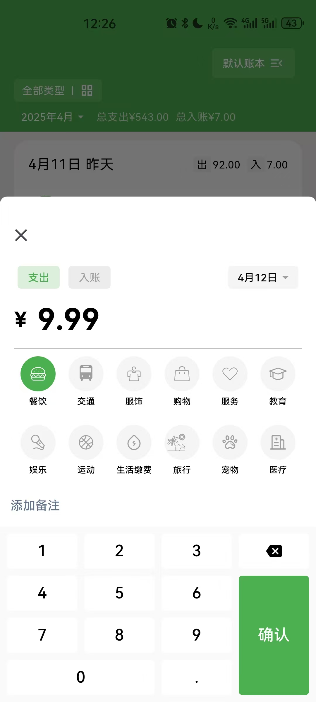
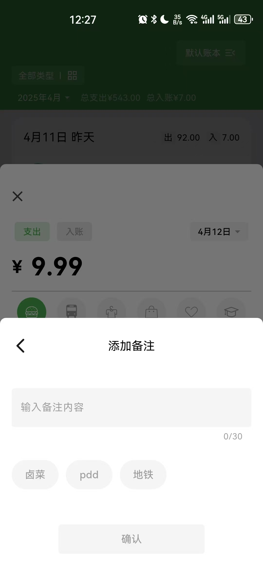

## 前言
最近在学习flutter跨平台框架，我认为学习一门语言最快的方式，把基础的理念大概过一遍后，就应该直接实战项目。一直看理论知识，不动手是很难消化的。
所以才诞生了这款记账本项目。
## 记账本
如果有用过微信记账本的朋友，应该会比较熟悉软件的功能和UI，因为我是直接仿照它做的。没有参考其他的记账本，是因为市面上很多记账本功能和UI繁琐，微信记账本比较简洁。
## 第三方依赖
1. sqflite  本地数据库用来存储数据。
2. flutter_bloc  状态管理库，用来替代flutter原生状态管理。bloc跟android mvi架构基本一致，所有对于搞android的我非常友好。
3. go_router  路由管理库。
4. fluttertoast  全局toast管理。
5. scrollable_positioned_list  滚动定位。引入这个库是因为flutter原生的listview没有类似android recyclerView findFirstVisibleItemPosition()跟findLastVisibleItemPosition()方法，这个库可以实现类似的方法。用来实现账单滑动判断月份，显示不同的月份价格。
6. syncfusion_flutter_charts  各种图表能力。
7. event_bus  事件总线。
8. flutter_svg  svg加载框架
## 软件功能截图

